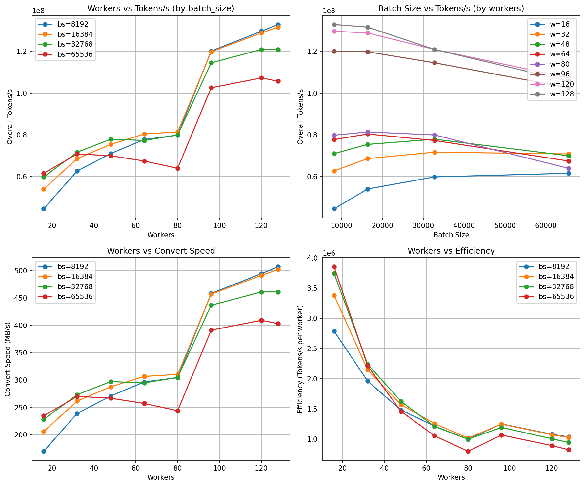
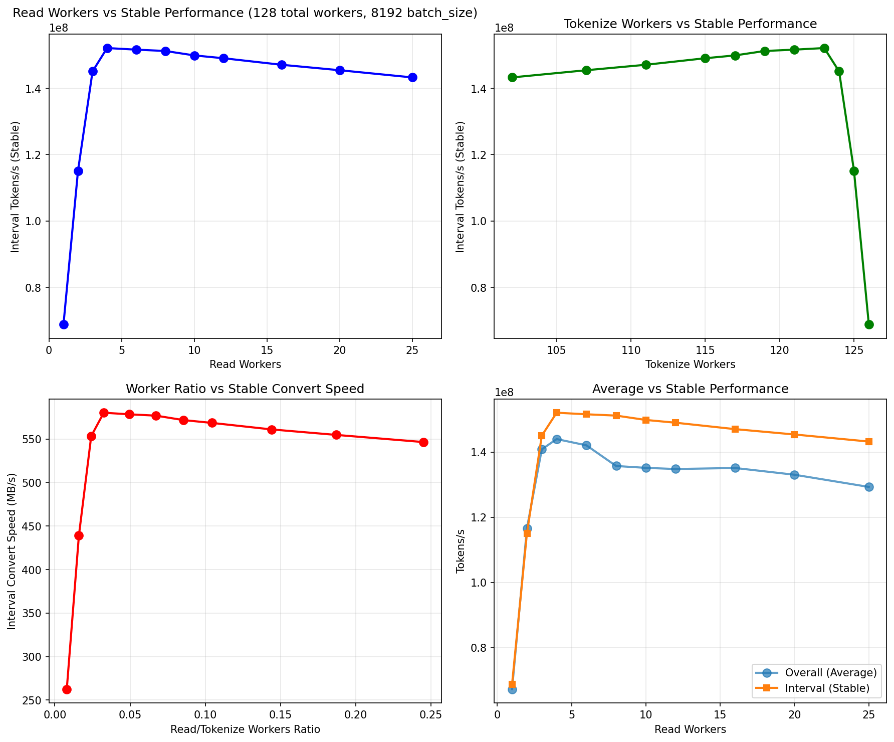
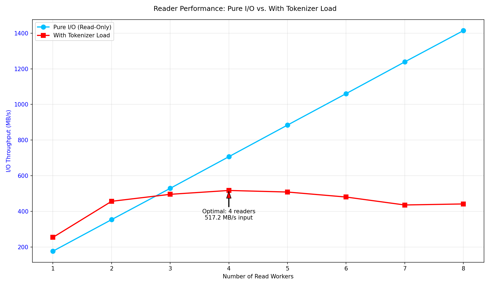
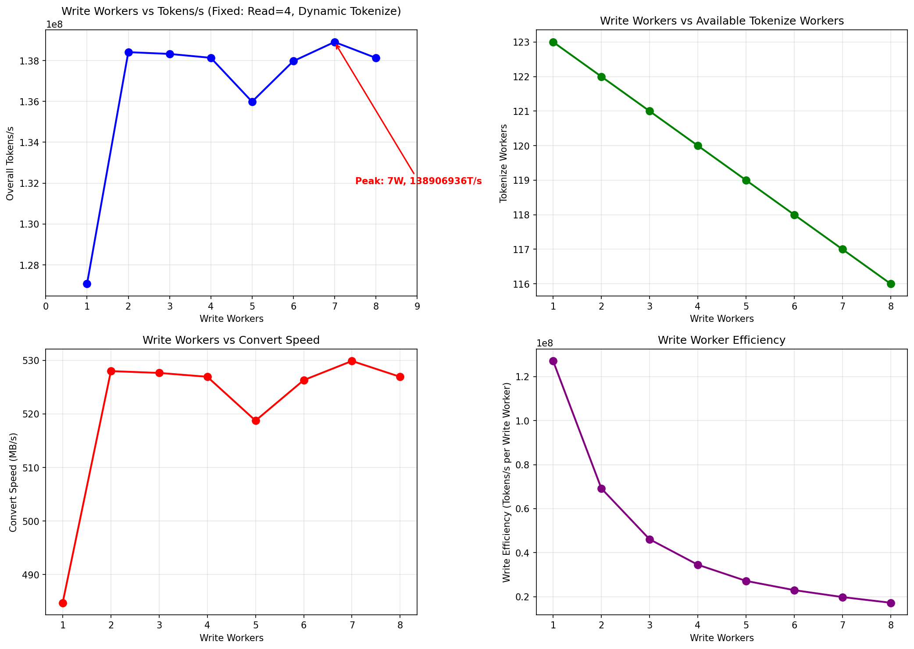

# Parquet2MBT 性能优化分析报告

## 1. 核心摘要

经过从基准探索到瓶颈验证、再到I/O精调的多轮系统性实验，我们成功地将Parquet2MBT的**稳定状态处理性能从129.6M tokens/s提升至151.6M tokens/s**，增幅达**17.0%**。

-   **最终最优配置（极致性能）**:
    ```bash
    --workers 128 --read-workers 5 --tokenize-workers 120 --write-workers 3 --batch-size 2048
    ```
-   **核心洞察**:
    1.  **瓶颈定位**: `Tokenize`是系统的核心计算瓶颈。
    2.  **I/O优化**: `Read`和`Write`阶段存在明确的“甜蜜点”，而非越多越好。`5个Read-Worker`和`3个Write-Worker`的组合被验证为当前最优。
    3.  **并发策略**: 小`Batch Size`（如2048）在极高并发下能取得更好的稳态性能。
    4.  **资源冗余**: 系统默认的`20% Read Worker`配比存在显著的资源浪费。

---

## 2. 优化历程

我们的优化分为四个阶段：建立性能基准、定位系统瓶颈、精细化I/O调优、以及探索高级并行化。

### 阶段一：建立性能基准 (实验一)

**目标**: 探索不同并发Worker和Batch Size下的性能表现，找到后续优化的基准点。

-   **测试维度**: Workers (16-120) × Batch Size (8192-65536)，无写入模式。
-   **核心发现**:
    -   **基准最优配置**: 在`Workers=120`, `Batch_Size=8192`时，获得了**129.6M tokens/s**的峰值性能。
    -   **性能跳跃**: 在`Workers`从80增至96时，性能出现了50%的异常跳跃，表明系统突破了某种资源限制。
    -   **初步假设**: 系统默认将约20%的worker分配给`Read`，我们假设这部分I/O资源存在冗余，而计算密集的`Tokenize`才是真正的瓶颈。

| Batch Size | 最佳Workers | 峰值性能(M tokens/s) |
| :--------- | :---------- | :------------------- |
| **8192**   | **120**     | **129.6**            |
| 16384      | 120         | 128.8                |
| 32768      | 120         | 120.9                |
| 65536      | 120         | 107.3                |



### 阶段二：定位真实瓶颈 (实验二 & 三)

**目标**: 科学地验证`Tokenize`是瓶颈，并找到最优的`Read:Tokenize` Worker比例。

-   **实验设计**:
    1.  **比例调优 (实验二)**: 固定总worker为128，系统性地减少`Read Worker`数量（从25减至1），将其余资源分配给`Tokenize Worker`。
    2.  **瓶颈验证 (实验三)**: 设计“纯I/O模式”(`--no-tokenize`)与“带载模式”，对比不同`Read Worker`数量下的吞吐量上限。

-   **核心发现**:
    -   **性能新高**: 在实验二中，当`Read Worker`数量为**4个**时，系统性能达到**152.1M tokens/s**，相比基准提升**17.7%**，证明了`Read Worker`确实存在冗余。
    -   **科学证明**: 实验三显示，“纯I/O模式”的吞吐量可以随`Read Worker`线性扩展至**1414 MB/s**，而“带载模式”的性能在4个`Read Worker`后开始下降。这清晰地证明了**I/O能力远超需求，瓶颈在于Tokenizer的处理能力**。
    -   **性能悬崖**: 少于4个`Read Worker`会导致“读取饥饿”，性能急剧下降，表明满足Tokenizer的数据供给存在一个最小阈值。

| Read Workers | Tokenize Workers | 性能(M tokens/s, 实验二) |
| :----------- | :--------------- | :----------------------- |
| 25           | 102              | 129.3                    |
| 8            | 119              | 135.8                    |
| 6            | 121              | 142.1                    |
| **4**        | **123**          | **🏆 152.1**             |
| 2            | 125              | 116.7                    |
| 1            | 126              | 67.3                     |




### 阶段三：精细化I/O调优 (实验四 & 六)

**目标**: 在确定最优`Read:Tokenize`比例的基础上，进一步优化`Write`阶段，并进行更大范围的风洞测试以验证和完善结论。

-   **实验设计**:
    1.  **写入优化 (实验四)**: 固定`Read Worker=4`，测试不同`Write Worker`数量（1-8）对启用真实写入模式下性能的影响。
    2.  **风洞测试 (实验六)**: 在`workers=128`的设定下，对`batch_size`, `read_workers`, `write_workers`的不同组合进行了全面的风洞测试。

-   **核心发现**:
    -   **最终性能峰值**: 综合所有测试，在实验六中，配置`5r:120t:3w`, `bs=2048`时，获得了**151.6M tokens/s**的最高稳定状态性能。
    -   **写入并非瓶颈**: `Write`阶段虽然不是主要瓶颈，但仍有优化空间。实验四显示2个`Write Worker`比1个提升2.1%。实验六则发现，在某些配置下，3个`Write Worker`表现更优。
    -   **小Batch Size优势**: 实验六揭示，在追求极致稳态性能时，更小的`Batch Size`(如2048)在高并发场景下表现最佳。

| Batch Size | 最优 Read:Tokenize:Write | Overall Tokens/s (M) | Interval Tokens/s (M) |
| :--------- | :----------------------- | :------------------- | :-------------------- |
| **2048**   | **5 : 120 : 3**          | **141.0**            | **🏆 151.6**          |
| 16384      | 5 : 120 : 3              | 🏆 143.0             | 150.5                 |
| 4096       | 4 : 122 : 2              | 142.3                | 146.4                 |
| 8192       | 6 : 118 : 4              | 141.7                | 149.3                 |



### 阶段四：探索高级并行化 (实验五)

**目标**: 验证`tokenizers`库内部的Rayon并行化是否能在已高度并发的场景下带来额外增益。

-   **核心发现**:
    -   **收益有限**: Rayon带来了微弱的性能提升（平均1.6%），但随着外部并发（worker数量）的增加，这种提升效果递减，甚至在CPU资源过度订阅时消失。
    -   **结论**: 在当前的高并发架构下，依赖外部多进程/线程的并行化模型更简单、性能更可预测。**默认不启用Rayon**。

---

## 3. 最终生产建议

### 🥇 极致性能配置

适用于离线大数据处理，追求最高吞吐量。

```bash
--workers 128 --read-workers 5 --tokenize-workers 120 --write-workers 3 --batch-size 2048
# 预期性能: 151.6M tokens/s (稳定状态)
```

### 🥈 稳健高性能配置

性能与长时间运行稳定性兼顾，推荐作为生产环境默认配置。此配置在全程平均性能指标上表现最佳。

```bash
--workers 128 --read-workers 5 --tokenize-workers 120 --write-workers 3 --batch-size 16384
# 预期性能: 143.0M tokens/s (全程平均)
```

### 🥉 平衡场景配置

适用于资源与性能需要平衡的场景，无需手动指定各阶段worker比例。

```bash
--workers 96 --batch-size 8192
# 预期性能: 120.1M tokens/s (全程平均)
```

---

## 4. 下一步工作

-   验证`5:120:3`配置在不同类型数据集上的稳定性。
-   深入分析`batch_size=2048`在高并发下取得性能优势的技术原理。
-   测试更高worker数量（如256）以找到系统的饱和点。
-   深入分析实验一中`96-worker`性能跳跃的根本原因。
-   探索分片大小对下游训练加载效率的实际影响。
-   研究多数据集并行处理的架构优化。

---
*报告更新时间: 2025-09-26*
*数据基于: 28个风洞测试用例 + 11个pipeline优化测试 + 16个Reader扩展性测试 + 8个Write Worker优化测试 + 5个Rayon并行化对比测试 + 60个新风洞测试用例*
